## Gardner's Theory of Multiple Intelligence

Howard Gardner in 1983 came up with a theory to challenge the traditional view on Intelligence. According to him, cognitive abilities of an individual does not solely constitue intelligence. He classified Intelligence into 8 categories viz. Verbal-Linguistic (Word Smart), Logical/Mathematical (Math Smart), Visual-Spatial (Picture Smart), Bodily-Kinesthetic (Body Smart), Musical (Music Smart), Interpersonal (People Smart), Intrapersonal (Self Smart), and Naturalist (Nature Smart). His theory suggested that people could be strong in multiple categories and their inclination is based on their experiences rather than their genetics. 


## Problem Statement

The Ministry of Culture, Government of India in 2018 released a problem statement stating that they wanted to gauge the aptitude of children using Gardner's theory of Intelligence. In India, children are groomed to follow traditional professions of engineering, medical science or law, often against their own wishes. By identifying the inclination of a child towards a particular Intelligence type, the Ministry wanted to urge parents to groom their children in disciplines where they were more likely to succeed.

## A game to identify the aptitude of a child

The tests to identify the aptitude of individuals involves long questionnares with written and spoken psychological evaluations. Although these methods do pay dividends and have their advantages, they have not worked well with children owing to their low attention spans. We devised a game that consists of many mini-games each of which tests the inclination of the player towards an intelligence type. The format of the game is designed such that the target group to play the game is completely oblivious of the fact that they are being tested.


The game has a simple back story, wherein the space ship of the player crashes into a planet. Due to the destruction caused the player is taken into custody. The prison guard however is unhappy about the unfortunate situation and keeps coming up with suggestions for the player to win over the king and return to his/her planet. Each of the suggestions are back stories for mini-games that the player ends up playing. 
 
#### Snapshots from the Video shown at the start of the game
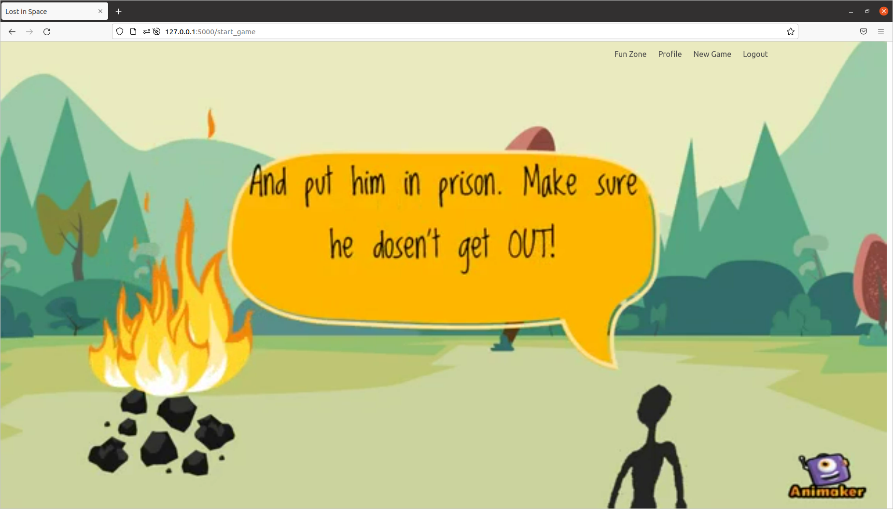


### Selection of the mini games

The mini-games that the user is required to play to progress are not played in sequence. Every user might get to experience different games in a different order in every session that they play. Children are likely to get bored if the mini-game that they are playing does not interest them or if they are really bad at it. Therefore the score shown on the front end in these mini-games have nothing to do with the final intelligence score that the player will get. The amount of time spent on the game is taken into context along with the performance of the game to get the score in each of the mini games.

In addition to that fact, most games require an amalgamation of intelligences for the player to do exceedingly well. Thus, each game has been analyzed by experts in the Gardner's theory and has been given a weightage across the intelligence types. 
A sample of how each game is characterized is given below.

```xml
   <Game ID = "7" name = "spacewars" levels = "3" >
      <Parameter picture ="0.1"></Parameter>
      <Parameter music = "0"></Parameter>
      <Parameter word = "0"></Parameter>
      <Parameter nature = "0"></Parameter>
      <Parameter body = "0.8"></Parameter>
      <Parameter people = "0"></Parameter>
      <Parameter self = "0"></Parameter>
      <Parameter logic = "0.1"></Parameter>
   </Game>
```

Based on the holistic score achieved by the player in these mini-games, suggestions are provided to play games that require intelligence types in which the player is doing better than the rest. The suggestions run out, and the game ends, if 2 things are achieved 

- Each intelligence type has been tested a mininum number of times.
- All the mini-games at all levels have been played in which the player has had the best performance. 

A mini-game typically does not last more than 2 - 3 minutes in order to retain the interest of the kid playing it. After every mini-game ends, the next game is selected heuristically keeping in mind the aforementioned goals.


#### Sample Transition between Mini-Games
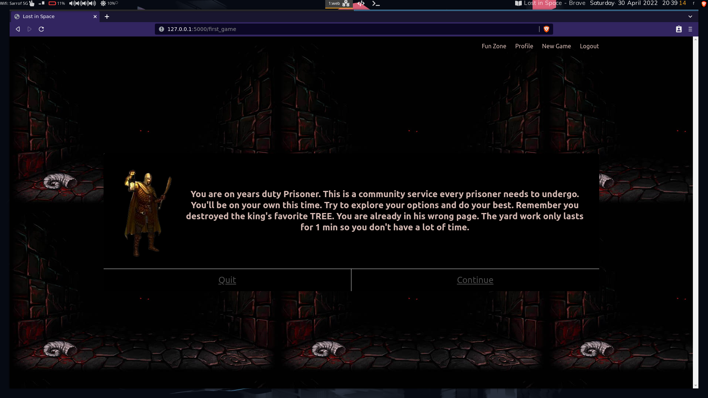

Once the game ends, the user is redirected to his/her home profile page, where the evaluation across intelligence types is shown. As mentioned before, an individual could be strong in multiple aspects, hence the scores achieved across the categories do not amount to 100. The most common professions associated with each intelligence type are listed, with the category in which the user had the best performance, in focus. The evaluation keeps getting updated, after every session is played.

#### Profile Evaluation Page


### Logical-mathematical
Often mistaken for the only form of intelligence possible, people who belong to this category recognize patterns quickly and enjoy working on solving reasoning problems. There is no dearth of logical reasoning games - Sudoku, Chess, Checkers etc have existed for long. To identify this intelligence type, we made the popular Connect 4 game and tuned it to have 3 levels of difficulty.

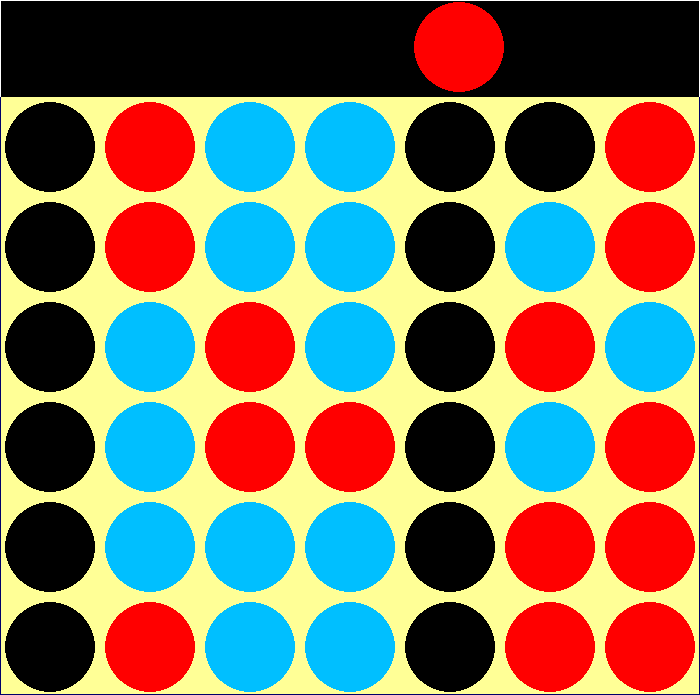

### Visual-Spatial
This category intersects with the logical intelligence types, since it also constitues recoginizing patterns. However, the pattern recognition is limited to pictures, maps or charts. Another parameter to judge this intelligence type is the ability of an individual to visualize information. We designed only 1 game that was specifically dedicated to identifying this intelligence type viz. Sliding Puzzle, where the player has to rearrange a jumbled picture into the original frame. However many of the other mini-games require visual intelligence to succeed as well. 

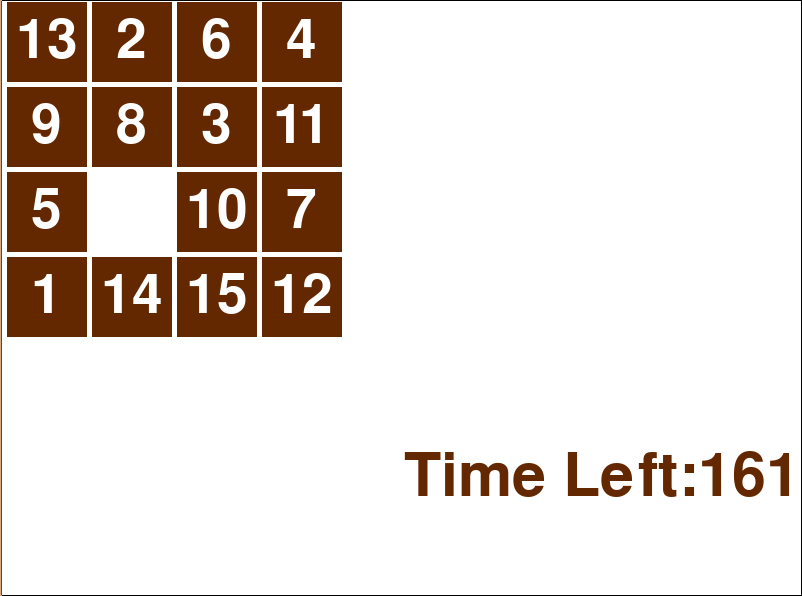


### Interpersonal
The ability to quickly understand the emotions of other people and consequently react adequately is referred to as Interpersonal intelligence. In the current version of the project, there aren't adequate games to judge this intelligence type. We have reverted to questionnares, however to garb the boring questions, the back story provided is that the player is working with the court philosopher to better manage the court proceedings.

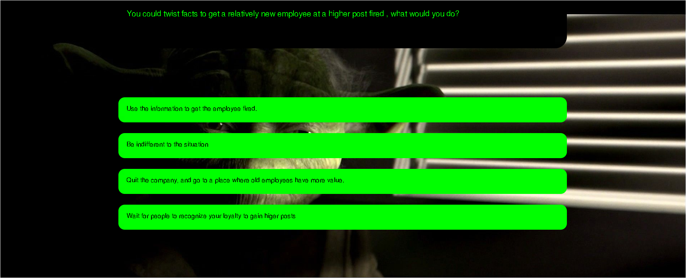

### Verbal-Linguistic
The ability to comprehend language and convey their thoughts eloquently in both written and spoken forms. People with linguistic intelligence can learn new languages quicker than others and tend to have a higher capacity to memorize information. We use 2 traditional word games at various difficulty levels to test this intelligence type.

- Bulls & Cows: The hidden 4 letter word needs to identifed in minimum number of guesses. After each guess, the player is given 2 numbers viz. the bull score which implies the number of letters that were in the correct position, and the cow score which implies the number of letters which were part of the hidden word but are in incorrect positions.

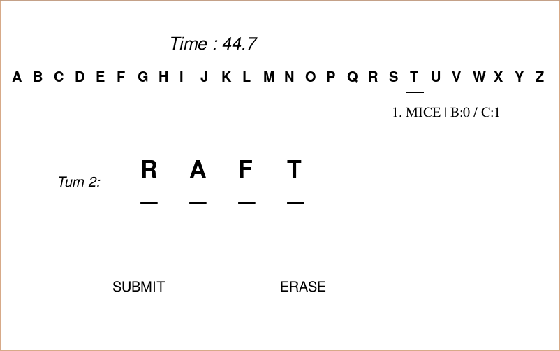

- Hangman: The hidden word needs to identified, by guessing the letter of the word one by one. The player is allowed 5 wrong 
guesses.

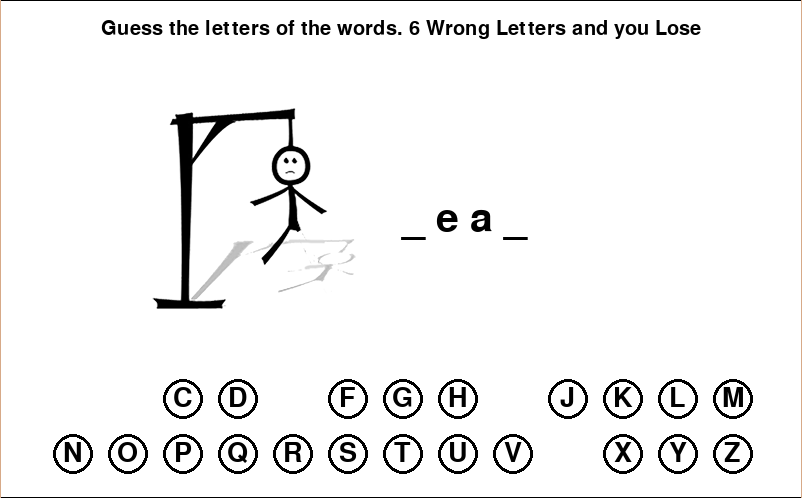

### Intrapersonal
The ability to be aware of one's longings, fears, limits and to utilize the data successfully. This kind of insight can assist an individual to understand their life objectives and how to accomplish them. Identifying this intelligence type is often redundant, since people who have good intrapersonal understanding are by definition aware of their strengths and weaknesses.
Similar to Interpersonal, we use a standard questionnare for testing this intelligence type and mask it with a back story.

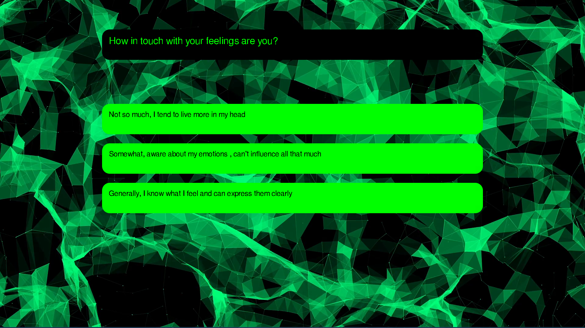

### Musical
Musical intelligence refers to the skill in the performance, composition, and appreciation of musical patterns. We test this intelligence types by providing a spin to the traditional memory game, where instead of matching pictures on hidden cells. The user has to identify cells emanating similar sounds. The game called Memory music has 3 levels of difficulty.

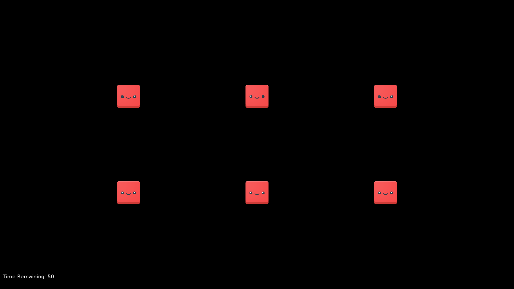

### Bodily-kinesthetic
People who are strong in this area tend to have excellent hand-eye coordination and dexterity. If identified early, children can grow up to have superior control over their body movements, become highly skilled at various sports and dancing forms. We identify this intelligence type, via 2 games

- Flappy Bird: The traditional game is played with a twist. Instead of using the keyboard to keep the bird from flying, the player's hand is tracked, and the hand movement mirrors the way the bird moves across the screen.

- Space Wars: Hand-eye coordination is tested, since multiple allies and enemies are confined to a small window space, and the user has to eliminate as many enemey ships possible accurately without hurting their own allies.

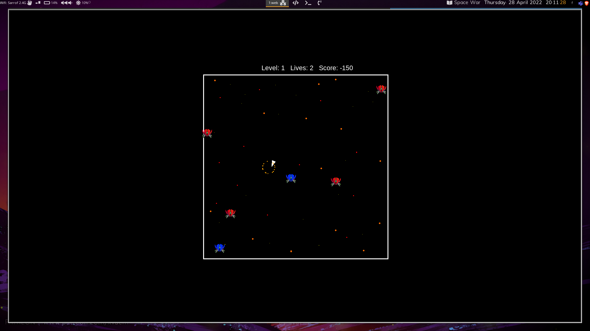

### Naturalistic
Individuals who are more in tune with the environment, and are interested in knowing more about the different flora and fauna species around the world. We made multiple games to identify this intelligence type

- Identify animals from their nature calls
- Identify different species of plants and animals.

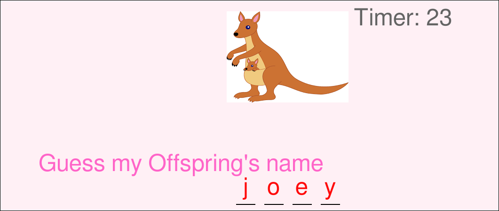

- Exploring Game, where the player roams around the map. There are options to plant saplings, water trees, cut the extra grass, move trash to the dustbin. The player however is not given any aim for this game. How, the player spends their time in this game, indicates their empathy towards nature. In a limited time span, trying the different variety of activities is given a higher score, compared to repeating a single activity and increasing the displayed score on the game page. 


### User Handling
**Sqlite** is used to save all the user and game related information. To ease quering of the database **Flask-SqlAlchemy** was used. The login, registration and user handling at this point is naive, as the focus of the prototype is the identification of the intelligence types.

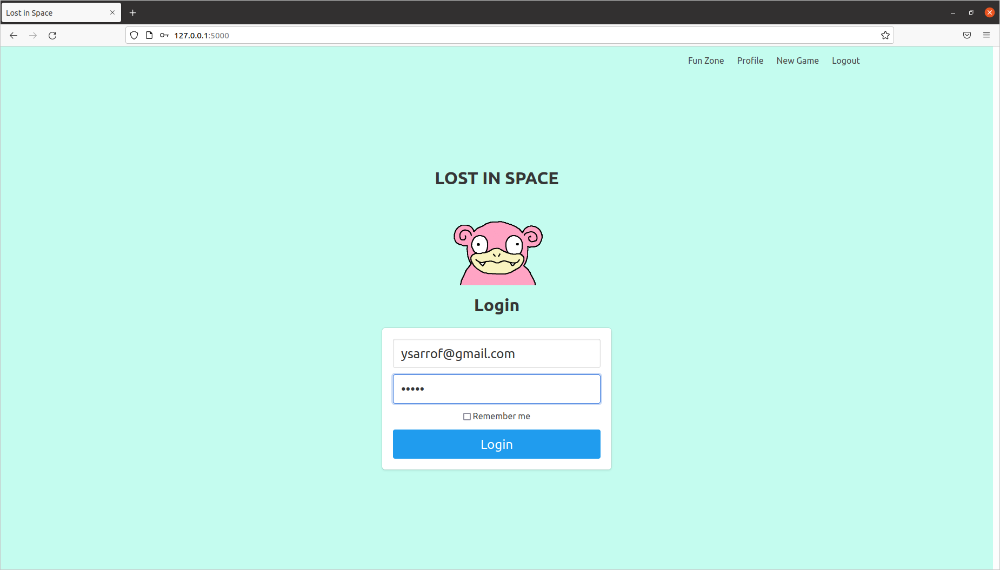

### Option to play only Mini-Games
There is a page on the flask server to facilitate playing the mini-games outside of the story mode. It should be noted that the scores achieved while playing games in this manner are not counted towards the overall profile evaluation of the player.

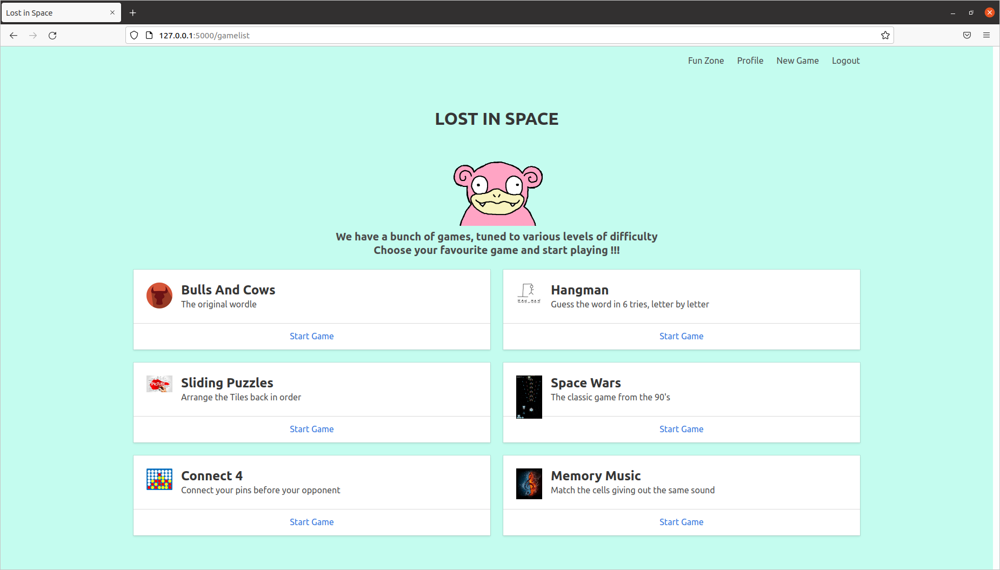


## Installation

1. Clone the repo
   ```sh
   git clone https://github.com/yashYRS/MultipleIntelligence.git
   ```
2. Install virtualenv
   ```sh
   python3 -m pip install --user virtualenv
   ```
3. Make a virtual Environnment and activate it
   ```sh
   virtualenv /path_to_env
   source /path_to_env/bin/activate
   ```
5. Install the requirements
   ```sh
   pip install -r requirements.txt 
   ```
6. Run the server, and open the link mentioned on console to use the application
   ```sh
   python main.py
   ```


### Shortcomings

- All the games as of now are spawned in separate windows and not on the browser itself. In an ideal scenario the user should be able to play all the games without leaving the browser window. Contributions on that front are welcome.
- Progress in a game is lost, if the player quits in the middle of a session. Therefore adding options to save/load previous sessions are needed. 
- Better RPG Games are needed to test Inter-personal intelligence. The ability to make allies, being empathetic towards violence around them could be used as markers for good performance.


### Project Background
The Smart India Hackathon (SIH) is organised annually by the Government of India. Problem statements are released by various private and government enterprises. Participating teams can choose to submit a proposal for any of the problem statements. If the proposal is selected, the teams have to reach a venue and build the proposed solution in a 36 hour code sprint. The submissions are judged by a panel elected by the same enterprise that released the problem statement. As mentioned earlier, the aforementioned problem statement was released by the Ministry of Culture in 2018, and this project was our teams' official submission towards the same, for which we were adjudged winners.

#### Team Members
<!--lint disable prohibited-strings-->
* [Arshia Anand](https://github.com/arshia29)
* [Damodar Nayak](https://github.com/DamodarNayak9398)
* [Daniel Savio](https://github.com/danyboy98)
* [Mohammad Aadil](https://github.com/moaadil)
* [Sushant Kumar](https://github.com/Sush78)
* [Yash Sarrof](https://github.com/yashYRS)